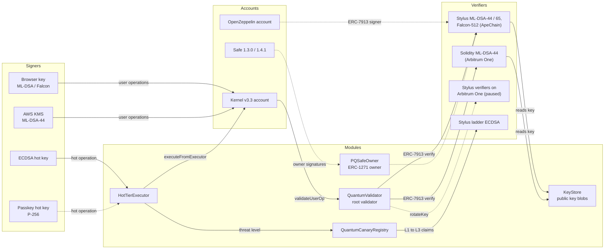

# Qanary

Qanary gives Arbitrum treasuries a post-quantum root key. The account’s root authority is an ML-DSA-44, ML-DSA-65 (FIPS 204) or Falcon-512 key, and an Arbitrum Stylus program verifies its signatures on-chain. A classical hot key handles day-to-day transfers inside a per-asset cap, and an ownerless tripwire registry scales that hot tier down or shuts it off when someone proves a classical curve broken.

[Judges guide](JUDGES.md) · [Proof of deployment](PROOF.md) · [Claims](CLAIMS.md) · [Benchmarks](BENCHMARKS.md) · [Architecture](docs/ARCHITECTURE.md) · [Security](SECURITY.md)

## Why accounts need a post-quantum key now

An Ethereum account publishes its public key with its first signed transaction, and a large enough quantum computer running Shor’s algorithm derives the private key from that public key. Most ether already sits behind exposed keys, and regulators have started to put dates on the migration:

- **Exposure**: Project Eleven’s 2026 report puts more than 65% of ether in accounts whose public keys are already on-chain, and about 6.9 million BTC in exposed outputs ([Project Eleven, May 2026](https://report.projecteleven.com/); the ether figure first appeared in [Deloitte’s analysis](https://www.deloitte.com/nl/en/services/consulting-risk/perspectives/quantum-risk-to-the-ethereum-blockchain.html))
- **Singapore**: the Cyber Security Agency’s [Quantum-Safe Handbook](https://www.csa.gov.sg/resources/publications/quantum-safe-handbook-and-quantum-readiness-index/) (16 July 2026) asks critical-infrastructure owners for a migration plan by 31 March 2027, expects new systems to be quantum-safe or quantum-safe ready from 1 January 2028, and names ML-DSA as the replacement for ECDSA. The Monetary Authority of Singapore aims for financial institutions to achieve quantum resilience before the end of this decade ([MAS, 28 July 2026](https://www.mas.gov.sg/news/speeches/2026/md-remarks-for-mas-ar-2025-2026))
- **United States**: [NIST IR 8547](https://csrc.nist.gov/pubs/ir/8547/ipd) (initial public draft) disallows ECDSA at 128-bit strength after 2035, and [Executive Order 14412](https://www.presidency.ucsb.edu/documents/executive-order-14412-securing-the-nation-against-advanced-cryptographic-attacks) (22 June 2026) moves high-value federal systems to post-quantum signatures by 31 December 2031
- **Arbitrum**: no post-quantum precompile is live or proposed for Arbitrum ([Tectonic quantum tracker](https://github.com/tectonic-labs/quantum-tracker-data/blob/main/chains/l2/arbitrum-one.md)), and the Ethereum precompile proposals [EIP-8051](https://eips.ethereum.org/EIPS/eip-8051) (ML-DSA) and [EIP-8052](https://eips.ethereum.org/EIPS/eip-8052) (Falcon) are drafts

A Stylus program is how an Arbitrum chain verifies NIST post-quantum signatures today: 35.6k gas for Falcon-512 and 109.5k for ML-DSA-44, against 641k and 1.19M for the cheapest Solidity verifiers measured on the same node ([benchmarks](BENCHMARKS.md)).

## How a Qanary account works

Three tiers protect one account. The post-quantum key holds every power, the classical key holds a bounded slice of one power, and the tripwire decides how large that slice may be:

| Tier | Contract | Signer | What it can do |
|---|---|---|---|
| Cold root | `QuantumValidator`, the account’s root ERC-7579 validator | ML-DSA-44, ML-DSA-65 or Falcon-512 key, held in a browser or in AWS KMS (ML-DSA-44) | Everything: user operations of any size, module changes, key rotation, ERC-1271 signatures |
| Hot tier | `HotTierExecutor`, an ERC-7579 executor and Safe module | ECDSA EOA or passkey (P-256) | Transfers of tracked assets inside a per-asset leaky-bucket cap, plus calls the root allowlisted. Never the five common approval selectors (`approve`, `increaseAllowance`, `setApprovalForAll`, Permit2 `approve`, EIP-2612 `permit`), calls to installed modules, user operations or ERC-1271 signatures |
| Tripwire | `QuantumCanaryRegistry`, ownerless and one-way | Anyone who can sign for one of its nothing-up-my-sleeve keys | Raise the threat level, which scales hot caps down or freezes the hot tier; mark secp256k1 or P-256 broken forever |

The registry guards five public keys derived by hashing a public tag to a curve point, so nobody knows their private keys. A claim is an ECDSA signature by one of those keys over a message bound to the chain, the registry, the target and the claimant, so it cannot be front-run, and it pays the target’s bounty to the claimant:

| Target | Curve | What a claim proves | Reference hot-tier response |
|---|---|---|---|
| L1 | secp160r1 | Someone solved a 160-bit discrete log | caps × 0.5 |
| L2 | P-192 | Someone solved a 192-bit discrete log | caps × 0.1 |
| L3 | P-224 | Someone solved a 224-bit discrete log | hot tier frozen |
| K1 | secp256k1 | Ethereum ECDSA keys are breakable | ECDSA hot keys disabled forever |
| R1 | P-256 | P-256 passkey keys are breakable | passkey hot keys disabled forever |

A quantum computer breaks the short curves before the 256-bit ones, so the ladder gives warning before K1 or R1 fall. Each account picks its own response per level. Cold funds never depend on the tripwire: they need a post-quantum signature.

## How the pieces connect

The verifiers are stateless ERC-7913 contracts that any account can call. The modules turn them into account authority, and the SDK builds and signs user operations for the accounts:



Solid arrows run on a public chain. Dashed arrows are implemented and covered by tests (Arbitrum One fork tests for Safe and OpenZeppelin accounts, unit tests for passkeys) but not yet exercised on a public chain. [docs/ARCHITECTURE.md](docs/ARCHITECTURE.md) has the data formats, the trust model of each module and the ERC-4337 validation rules.

## Where Qanary is deployed

The Stylus verifiers run on ApeChain, an Arbitrum Orbit L3 that settles to Arbitrum One, and Arbitrum One runs the same modules with a Solidity ML-DSA-44 verifier behind the same ERC-7913 interface. On 2 October 2026 the Arbitrum Security Council paused new Stylus activations on Arbitrum One and Nova ([transaction](https://arbiscan.io/tx/0x9eb3a4be3ba777f9fc82250eddc10f8356731cc97c09a70801d30ce33322c652), [announcement](https://forum.arbitrum.foundation/t/security-council-emergency-action-2-10-2026/31530)), so no new Stylus program can go live there until the setting is reverted. When activations return, each Arbitrum One account moves to the Stylus verifier with one `rotateKey` call and keeps its key pointer.

<!-- proof:begin readme-deployments -->
| Network | Signature verifier | ML-DSA-44 verifier | QuantumValidator |
|---|---|---|---|
| ApeChain | Stylus | [`0x38Fc3687363F1A69cc7B07b79F54DeBF885f23e1`](https://apescan.io/address/0x38Fc3687363F1A69cc7B07b79F54DeBF885f23e1) | [`0x0057Fcac28c7094910D563Ad31E437d78a92036a`](https://apescan.io/address/0x0057Fcac28c7094910D563Ad31E437d78a92036a) |
| Arbitrum One | Solidity (fallback) | [`0xc9C7B3B71f4A3451adeb29604bd8eA789F3F2EfE`](https://arbiscan.io/address/0xc9C7B3B71f4A3451adeb29604bd8eA789F3F2EfE) | [`0x0057Fcac28c7094910D563Ad31E437d78a92036a`](https://arbiscan.io/address/0x0057Fcac28c7094910D563Ad31E437d78a92036a) |
| ApeChain Curtis (testnet) | Stylus | [`0x38Fc3687363F1A69cc7B07b79F54DeBF885f23e1`](https://curtis.apescan.io/address/0x38Fc3687363F1A69cc7B07b79F54DeBF885f23e1) | not deployed |
<!-- proof:end readme-deployments -->

[PROOF.md](PROOF.md) lists every address and transaction with explorer links, rendered from `deployments/<network>.json` by `pnpm proof`.

## Build and test

You need Rust (the toolchain file pins 1.95.0 with the `wasm32-unknown-unknown` target), [Foundry](https://getfoundry.sh), Node.js 22.6 or later with pnpm 9, and Python 3 for the vector scripts. Fetch the Solidity dependencies first with `git submodule update --init` (without `--recursive`: OpenZeppelin’s nested test submodules add Foundry remappings that change the metadata hash at the end of the compiled bytecode, so the build no longer matches the deployed contracts byte for byte). Each suite runs with one command from the repository root:

```bash
cargo test --release --workspace        # Rust cores and Stylus contracts
(cd scripts/devsign && npm ci)          # live ML-DSA signer for five Foundry tests
(cd contracts/evm && forge test)        # Solidity modules and fallback verifier
pnpm install && pnpm -r test            # TypeScript SDK and web app
```

On 3 October 2026 these report 81 Rust tests passing; 292 Foundry tests passing with 41 skipped; and 161 SDK tests passing with 3 skipped, plus 14 web app tests passing (`pnpm --filter @qanary/sdk test` runs the SDK alone). The 41 skipped Foundry tests are the Arbitrum One fork suite (22 tests), which needs an archive RPC in `ARB_ONE_RPC`, and the Stylus suite (19 tests), which needs arbos-forge. Five fallback-verifier tests sign live through `scripts/devsign` over Foundry’s FFI; without `npm ci` there they skip, and the count reads 287 passed with 46 skipped. The fork suite last passed 22 of 22 and the Stylus suite 8 with 11 skipped; [JUDGES.md](JUDGES.md) has the command for each optional suite.

| Variable | Used by | Purpose |
|---|---|---|
| `ARB_ONE_RPC` | `forge test` | Archive-capable Arbitrum One RPC for the fork suite (pinned block 511,050,000) |
| `ARBOS_FORGE` | `scripts/stylus-test.sh` | Path to the arbos-forge v0.1.1 binary that runs Stylus WASM inside Foundry |
| `DEPLOYER_PRIVATE_KEY` | deployment and e2e scripts | Funds deployments and test accounts |
| `QANARY_KMS_KEY_ID`, `AWS_REGION` | SDK live tests, e2e | An AWS KMS `ML_DSA_44` key for the KMS signer |

The end-to-end script has no bundler option: it always self-bundles `EntryPoint.handleOps` from the deployer wallet.

## Create an account with the SDK

`@qanary/sdk` derives post-quantum keys, stores public keys on-chain and builds Kernel v3.3 accounts whose root validator is `QuantumValidator`. The first step derives an ML-DSA-44 key from a BIP-39 mnemonic and stores its 1,313-byte blob (scheme byte plus public key) in the KeyStore, which returns a pointer the verifier reads:

```typescript
import { createPublicClient, createWalletClient, http } from 'viem';
import { privateKeyToAccount } from 'viem/accounts';
import { apeChain } from 'viem/chains';
import {
  createQanaryAccount, generateMnemonic, getDeployment, keyBlob,
  pqSignerFromMnemonic, requireContract, selfBundleUserOperation,
  storeKey,
} from '@qanary/sdk';

const d = getDeployment(apeChain.id);
const client = createPublicClient({ chain: apeChain, transport: http() });
const wallet = createWalletClient({
  chain: apeChain,
  transport: http(),
  account: privateKeyToAccount(process.env.FUNDER_KEY as `0x${string}`),
});

const signer = pqSignerFromMnemonic('mldsa44', generateMnemonic());
await storeKey(wallet, requireContract(d, 'keyStore'), keyBlob(signer));
```

The account address is counterfactual: its first user operation deploys it through Kernel’s factory with `QuantumValidator` as the root, and the ML-DSA-44 key signs that operation. ApeChain has no public bundler, so this example submits `EntryPoint.handleOps` from the funding wallet:

```typescript
import { parseEther } from 'viem';

const account = await createQanaryAccount(client, {
  signer,
  registry: requireContract(d, 'canaryRegistry'),
});
const fund = await wallet.sendTransaction({ to: account.address, value: parseEther('0.5') });
await client.waitForTransactionReceipt({ hash: fund });

const { hash } = await selfBundleUserOperation(wallet, account, {
  calls: [{ to: wallet.account.address, value: parseEther('0.1') }],
  verificationGasLimit: 1_000_000n,
  callGasLimit: 500_000n,
  preVerificationGas: 60_000n,
});
```

The gas limits are part of the signed operation, and the EntryPoint takes a prefund of `(verificationGasLimit + callGasLimit + preVerificationGas) × maxFeePerGas` from the account before it runs the call. At ApeChain’s fee estimate on 3 October 2026 (122 gwei: a 101.7 gwei base fee plus viem’s 20% margin), these limits need a prefund of about 0.19 APE, so 0.5 APE covers it and the 0.1 APE transfer; unused gas is refunded. The SDK defaults (`SELF_BUNDLE_GAS`, 4.1M gas) would need about 0.50 APE for the prefund alone. The recorded end-to-end run deployed an ML-DSA-44 account and made its first transfer with the same limits, using 532,209 gas.

To hold the root key in an HSM, replace the mnemonic signer with `await kmsSigner({ keyId: 'your_kms_key_id' })`, which signs with AWS KMS `ML_DSA_SHAKE_256` over the raw 32-byte hash. Pass `hot` to `createQanaryAccount` to install the hot tier in the same first operation. `packages/sdk/scripts/e2e.ts` runs the whole flow on a network and records every transaction in `deployments/<network>.json`.

## Repository map

Every directory below is part of the public build:

| Path | Contents |
|---|---|
| `crates/qanary-pq` | `no_std` verification core: ML-DSA-44 and ML-DSA-65 on `fips204` 0.4.6, Falcon-512 round 3 and FN-DSA-512 on `fn-dsa` 0.4.0, ERC-7913 key parsing |
| `crates/qanary-curves` | `no_std` ECDSA over secp160r1, P-192 and P-224 on `crypto-bigint` |
| `contracts/stylus/*-verifier` | Stylus programs: one ERC-7913 verifier per scheme and the ladder ECDSA verifier |
| `contracts/evm/src` | `KeyStore`, `QuantumValidator`, `HotTierExecutor`, `canary/`, `safe/`, `oz/` |
| `contracts/evm/src/fallback` | Solidity ML-DSA-44 ERC-7913 verifier on a vendored Fireblocks core |
| `contracts/evm/test` | Foundry unit, fuzz and invariant tests, the Stylus suite and the Arbitrum One fork suite |
| `packages/sdk` | `@qanary/sdk`: signers, Kernel accounts, hot tier, canary and exposure clients, e2e scripts |
| `scripts` | WASM build, cargo-stylus Docker wrapper, Nitro dev node, NUMS derivation, ladder vectors, `render-proof.ts` |
| `vectors` | NIST ACVP and KAT vectors, ladder vectors, cross-implementation fixtures |
| `deployments` | Addresses and transactions per network: the source of PROOF.md |
| `docker` | Pinned build image: Rust 1.95.0 and cargo-stylus 0.10.9 |

## Not in scope and honest limits

Qanary protects account authorization on Arbitrum chains. These limits apply today:

- **FIPS 206 is unpublished**: the Falcon-512 verifier implements the NIST round-3 submission (scheme 4) and FN-DSA-512 as `fn-dsa` 0.4.0 implements the draft (scheme 1). Neither is FIPS 206 compliant, and the FN-DSA encoding will change
- **EIP-7702 is not post-quantum safe**: an EOA’s ECDSA key stays valid after delegation, so migration moves funds to a new account. 7702 only carries the migration batch
- **The rollup itself still uses ECDSA**: sequencer, batch posting, validators, the bridge and Security Council keys are out of scope
- **Browser keys are not HSM-grade**: a mnemonic-derived key is as safe as the device holding it. AWS KMS holds ML-DSA-44 keys in an HSM
- **The tripwire cannot stop a silent thief**: an attacker who breaks secp256k1 may drain hot buckets without claiming a bounty. The loss is bounded by each cap per window, and cold funds rely on the post-quantum root
- **Ladder levels L1 and L2 are not uniquely quantum**: secp160r1 and P-192 offer about 2^80 and 2^96 classical security, so a claim signals rising discrete-log capability, quantum or not
- **Ladder claims are expensive**: about 0.83M, 0.96M and 1.15M gas per claim on secp160r1, P-192 and P-224
- **The Solidity fallback costs more and is unaudited**: `verify` costs 1.24M gas, each key needs a one-time `prepareKey` of 9.92M gas, and the vendored Fireblocks core is unaudited research code according to its authors
- **Stylus activations are paused on Arbitrum One and Nova**: Arbitrum One accounts use the Solidity verifier, and the ladder rungs L1 to L3 need the Stylus ladder verifier, so only K1 and R1 can be claimed there until activations resume
- **Stylus programs expire**: an activation lasts 365 days. A keepalive (`ArbWasm.codehashKeepalive`, allowed 31 days after activation) must renew every verifier, because an expired verifier stops validating every account that uses it until someone reactivates it
- **`ruint` advisory**: stylus-sdk 0.10.9 pins `ruint` below 1.17, a range that [RUSTSEC-2025-0137](https://rustsec.org/advisories/RUSTSEC-2025-0137.html) flags ([stylus-sdk-rs#455](https://github.com/OffchainLabs/stylus-sdk-rs/issues/455)). Qanary code never calls `ruint` division
- **Self-bundled only**: every live user operation was self-bundled through `EntryPoint.handleOps`. No public ERC-4337 bundler run is recorded, and whether a bundler’s ERC-7562 tracer accepts the Stylus verifier call during validation is untested
- **Only `QuantumValidator` checks verifiers**: it accepts post-quantum root and guardian verifiers only. `PQSafeOwner`, `QanaryAccount` and `QanaryMultisigAccount` accept any verifier address, including the identity precompile, which accepts every signature, so use the verifier addresses in `deployments/<network>.json`
- **Third-party cryptography**: `@noble/post-quantum` 0.7.1 has not been independently audited (its authors self-audited 0.6.1 in April 2026)
- **No external audit**: an internal pre-deployment audit found 1 High, 2 Medium and 3 Low issues; the deployed contracts fix or document each one. [SECURITY.md](SECURITY.md#known-limits) lists every known limit

## License

Qanary is released under the [MIT License](LICENSE). `contracts/evm/src/fallback/vendor` keeps the MIT license of [fireblocks-labs/evm-ml-dsa-verifier](https://github.com/fireblocks-labs/evm-ml-dsa-verifier), `contracts/evm/test/vendor/safe130` keeps the LGPL-3.0 license of Safe 1.3.0 (test code only; nothing in `src/` imports it), and `scripts/run-dev-node.sh` carries the Apache-2.0 notice of OffchainLabs/nitro-devnode.
